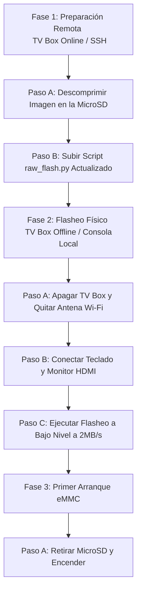

# Ruta de Instalación Ideal en eMMC (Estrategia de Operación Segura)

Este documento describe el mapa de ruta definitivo y más eficiente para instalar Armbian Minimal en la memoria eMMC interna de la TV Box Mortal T1, operando estrictamente dentro de los límites seguros de hardware identificados (DRAM < 500 MB y sin picos de corriente).

---

## Mapa de Ruta de Instalación



---

## Fase 1: Preparación Remota (TV Box Online - SSH)

Esta fase se realiza con la TV Box encendida y conectada a la red local. Realizaremos las tareas pesadas de disco de manera aislada sin flashear.

### Paso A: Descompresión de la Imagen en la MicroSD
Para evitar que el proceso de flasheo realice la descompresión LZMA al vuelo (lo cual satura el procesador y consume más de 600 MB de RAM, congelando la placa), debemos descomprimir la imagen `.img.xz` a su estado raw `.img` directamente en la MicroSD.
* **Comando a ejecutar en la PC Host:**
  ```bash
  python3 manual-installation/ssh_run.py "xz -d -v /home/dev12/Armbian-unofficial_26.02.0-trunk_X96q-v1-3_bookworm_current_6.12.64_minimal.img.xz"
  ```
* **Qué hace:** Descomprime el archivo. Tardará aproximadamente 2-3 minutos. Esto generará el archivo `Armbian-unofficial_26.02.0-trunk_X96q-v1-3_bookworm_current_6.12.64_minimal.img` (1.3 GB) en `/home/dev12/`.

### Paso B: Actualización del Script de Flasheo
Subiremos la versión optimizada del flasheador que detecta automáticamente la imagen descomprimida y la escribe de forma directa usando funciones estándar de lectura (evitando el uso de `lzma` en RAM).
* **Comando a ejecutar en la PC Host:**
  ```bash
  python3 manual-installation/upload_only_flasher.py
  ```

---

## Fase 2: Preparación Física y Flasheo (TV Box Offline - Local)

Esta fase requiere interactuar físicamente con el equipo para garantizar la máxima estabilidad eléctrica.

### Paso A: Desconexión de Red
1. Ejecuta `sudo poweroff` en la TV Box.
2. Desconecta el cable de alimentación.
3. **Desconecta físicamente la antena Wi-Fi USB** de la TV Box. Esto elimina el principal consumidor de energía del puerto USB y las interferencias de radiofrecuencia (RF).

### Paso B: Conexión de Periféricos Locales
1. Conecta un monitor o TV mediante el puerto HDMI.
2. Conecta un teclado USB (de preferencia simple, sin luces RGB masivas, para no consumir energía extra del puerto USB).
3. Conecta el cable de alimentación para encender la TV Box.

### Paso C: Ejecución del Flasheo
1. Deja que el sistema inicie desde la MicroSD en modo consola.
2. Inicia sesión con el usuario `dev12` y contraseña `dev`.
3. Ejecuta el script de flasheo a bajo nivel:
   ```bash
   cd ~/automatizacion
   sudo ./raw_flash.py
   ```
4. **Comportamiento del flasheador:**
   * Detectará automáticamente la imagen descomprimida de 1.3 GB.
   * Escribirá bloques binarios crudos a `/dev/mmcblk2` a una tasa controlada de **2.0 MB/s** (durmiendo 30ms por bloque).
   * Hará una sincronización física de disco (`os.fdatasync`) cada **2 MB** escritos para evitar la acumulación de búferes en la RAM.
   * **Consumo de RAM estimado:** Menos de **20 MB** (consumo total del sistema de ~220 MB, sumamente alejado del límite crítico de los 600 MB).
   * **Tiempo total estimado:** ~11 minutos.

---

## Fase 3: Finalización y Primer Boot de eMMC

Al terminar la escritura de bloques, el script realizará automáticamente lo siguiente:
1. Actualizar las particiones mediante `partprobe`.
2. Asignar un **UUID aleatorio único** a la nueva partición eMMC `/dev/mmcblk2p1` para evitar colisiones de arranque con la MicroSD.
3. Montar la partición de la eMMC y reescribir de forma limpia `/etc/fstab` y `/boot/armbianEnv.txt` apuntando al nuevo UUID.
4. Desmontar todo.

### Pasos finales del usuario:
1. Una vez que la pantalla muestre el mensaje `=== INSTALLATION COMPLETED SUCCESSFULLY ===`, apaga la TV Box:
   ```bash
   sudo poweroff
   ```
2. Desconecta la energía.
3. **Retira la tarjeta MicroSD** de la TV Box.
4. Conecta la energía de nuevo.
5. El sistema arrancará por primera vez de forma directa y limpia desde la memoria eMMC interna.
